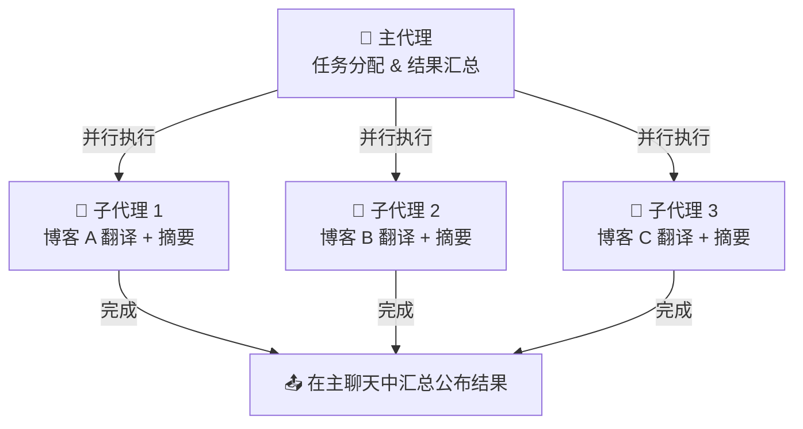

# Day 9：多 Agent 团队配置指南

> 💡 **学习目标**：从“全能型单体 Agent”进化到“分工明确的 AI 团队协作”。

## 为什么单 Agent 不够用？

当你习惯了强大的单一 Agent 后，必定会遇到以下发展瓶颈：
1. **上下文污染**：刚让它写完严肃的商业企划方案，下一秒让它帮你写段子，模型可能因无法立刻切换语气而产生违和的回答。
2. **工具链冲突**：把画图、发邮件、写代码等几十个工具全塞给一个 Bot，大语言模型在挑选工具时极易“注意力分散”，导致响应变慢或幻觉。
3. **渠道风格差异**：在飞书上你需要它是一个严谨的工作流助手，而在 Telegram 上你可能只想要个毒舌树洞。

这就引出了 **OpenClaw 的多 Agent 协作**理念：让不同的 Agent 扮演特定的专家，组合成一支能互相配合的虚拟团队。

## 架构核心：三层物理隔离

在 OpenClaw 中，不同的 Agent 不仅仅是换了个名字，它们在底层有物理级别的隔离机制，这保证了“术业有专攻”：
- **认证与模型隔离 (`agents/<id>/agent/`)**：不同 Agent 可以绑定不同的 API Key 和模型组合（比如翻译员部署为 Claude 3.5 Sonnet，画图员使用擅长意图解析的独立模型）。
- **记忆隔离 (`agents/<id>/sessions/`)**：独立生成日记本和上下文序列，彼此互不串台。
- **灵魂隔离 (`workspace-<id>/`)**：每个 Agent 完全独享自己的 `SOUL.md` 和 `IDENTITY.md`。

## 如何搭建多 Agent 团队？

### 步骤 1：录入“新员工”
使用 CLI 指令快速创建并初始化新 Agent 的工作区：
```bash
# 添加一个专注编程的 Agent
openclaw agents add coder

# 添加一个负责营销写作的 Agent
openclaw agents add writer
```
创建完成后，别忘了为他们分别定制独特的 `SOUL.md` 职业设定。

### 步骤 2：分配沟通渠道（Bindings）
我们需要给每位员工指派接待窗口。OpenClaw 的路由机制非常灵活，通过修改 `openclaw.json`，我们可以精确控制消息流向（被称为 Bindings 机制）：
```json
{
  "agents": {
    "list": [
      { "id": "main", "workspace": "~/.openclaw/workspace-main" },
      { "id": "coder", "workspace": "~/.openclaw/workspace-coder" }
    ]
  },
  "bindings": [
    {
      "agentId": "coder",
      "match": {
        "channel": "telegram",
        "peer": { "kind": "direct", "id": "老板的电报ID" }
      }
    }
  ]
}
```
**规则解析**：路由绑定依赖明确的优先级。这种“分身术模式”确保了最精准的人员调度：精准匹配 ID 级别 > 频道级别匹配。

## 进阶：Agent 间通信（内线电话）

对于复杂任务，我们需要 Agent 互相打配合。OpenClaw 提供了四大协作模式（Supervisor、Router、Pipeline、Parallel）。其中最实用的为设置一个中央统筹者（Supervisor 监督者模式）。

首先，在 `openclaw.json` 中配置白名单，启用 `sessions_send` 内线电话机制：
```json
{
  "tools": {
    "agentToAgent": {
      "enabled": true,
      "allow": ["main", "coder", "writer"]
    }
  }
}
```

随后，在主 Agent `main` 的 `SOUL.md` 里赋予其**调度包工头**职责：
> “你是团队的调度核心。当收到编程或技术研发需求，你应当使用工具传达给 @coder 处理；收到公众号写作需求，应下发给 @writer。最后由你整合多方结果回复给用户。”

如此一来，当你发出一条重磅级长任务时，后台的群智大脑将自行建群、拆解并执行你的指令！

## 实战案例：子代理 (Sub-Agent) 的并行火力

除了上述固定的不同角色 Agent，OpenClaw 还提供了一种极其实用的“子代理实战模式”：即**主代理将繁重任务临时委托给多名“临时工（子代理）”并行处理**的模式。

### 场景挑战
想象一下，你一次性丢给主代理 3 篇动辄上万字的长篇英文技术博客，要求它翻译并做出摘要。
如果是传统的单线处理，模型可能因为上下文太长而崩溃，或者处理时间极长。

### 解决方案：并行执行架构
当你发送指令：“同时翻译这 3 篇技术博客，并分别做摘要”时，在 OpenClaw 的子代理生态中，会发生如下的“裂变”级联操作：



此时，主代理就像一个项目经理，它立刻原地召唤出 3 个独立的子代理（Sub-Agent）线程。每个线程独立负责一篇博客的处理（无论是消耗的上下文还是处理时间，都完全拆分了）。当 3 个子代理都各自处理完任务后，主代理会将结果完美地拼接总结，一次性回复给你！

### 子代理管理指令
在支持 Slash Command 的渠道（如 Telegram 中），你甚至可以随时监控这个“包工头”下面的工人状态：
- `/subagents list`：查看当前正在运行的并行子代理任务
- `/subagents log <id>`：抽查某个特定子代理的工作日志
- `/subagents stop all`：一键叫停所有子代理

## 今日挑战
将你的 OpenClaw 进化为双 Agent 架构（例如：日常助理 + 代码达人）。为它们分别指派工作平台，并尝试抛出一个能够触发“子代理”并行执行的重度任务组合。
